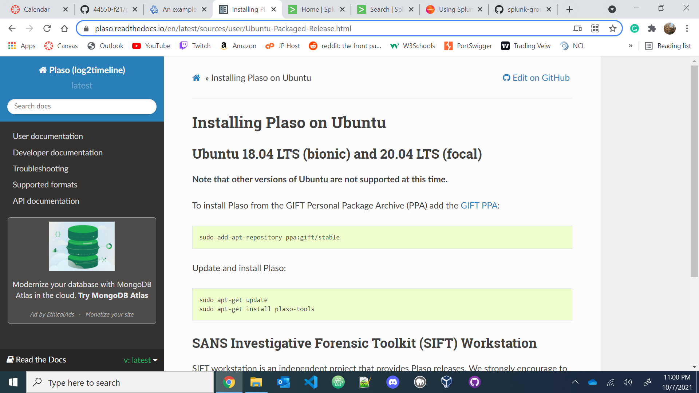
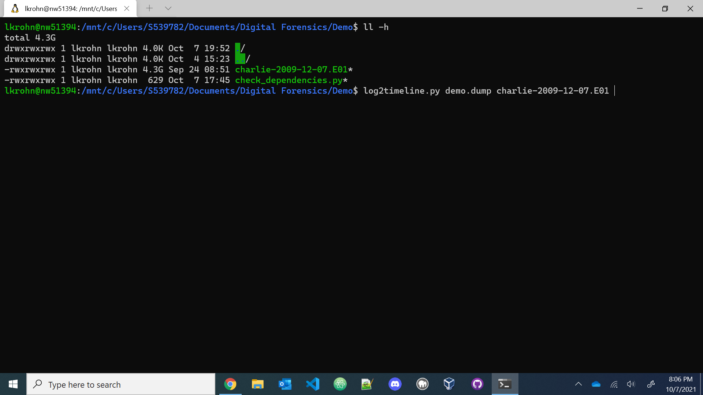
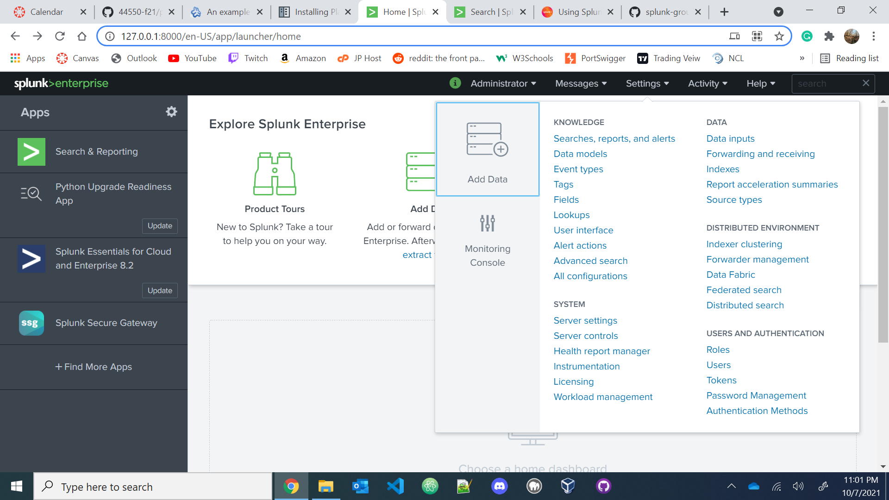
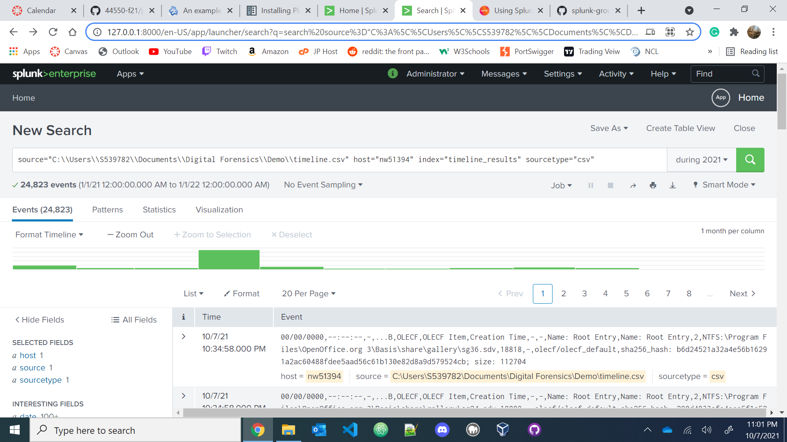

# Splunk-with-Plaso-L2TL
1. Go to https://plaso.readthedocs.io/en/latest/sources/user/Ubuntu-Packaged-Release.html and use the following commands in WSL to install the repository and Plaso for Ubuntu 20.04. 
2. Find a disk image you want to use and use the command 'log2timeline.py plaso.dump name-of-disk-image'. If asked to choose a partition, select the partition with the most content. If asked to select a VSS(volume shadow snapshot), select -all.
4. After completion use the command 'psort.py -o l2tcsv -w timeline.csv plaso.dump' to sort the content and write the database into a .csv file which we will use later.
5. In Splunk, go to settings and create a new index. Once done, go back to settings/Data Inputs/File and Directories and choose your .csv file to add to your index. 
7. Explore the index with the Search tool and the bar chart showing you the activity of the Image file in chronological order. 
